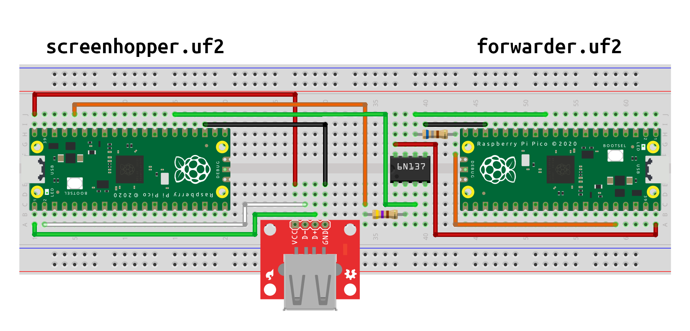
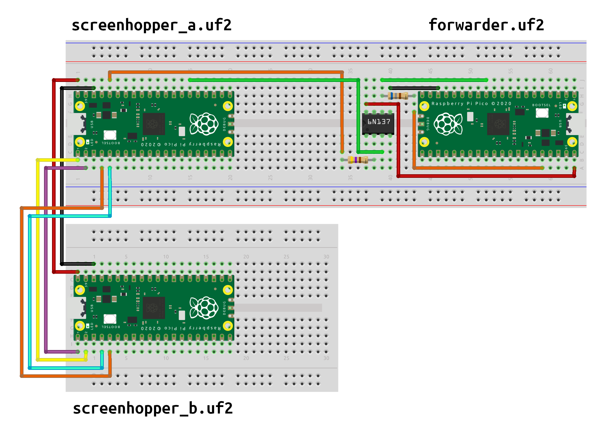

# How to make the device

There are two hardware versions of the Screen Hopper: the dual Pico version and the triple Pico version. They have the same functionality, but the triple Pico version has better device compatibility - some input devices work with either, but some will only work with the triple Pico version.

The reason for multiple Picos is that we need three USB interfaces and the RP2040 chip only has one. In the dual Pico version one of the interfaces is "bit-banged" (implemented in software) using the awesome [Pico-PIO-USB](https://github.com/sekigon-gonnoc/Pico-PIO-USB) library by [sekigon-gonnoc](https://github.com/sekigon-gonnoc).

The Picos talk to one another over serial.

To flash the Picos with the appropriate firmware (see below), hold the BOOTSEL button while connecting the Pico to the computer, then copy the right UF2 file to the "RPI-RP2" drive that shows up. You can find precompiled UF2 files in the [firmware](firmware) folder.

## Dual Pico version

This version is made using:

* two Raspberry Pi Picos
* 6N137 optocoupler
* USB Type A female breakout board (or you could use a USB extender cable cut in half)
* 470 ohm resistor (or similar)
* 680 ohm resistor (or similar)
* breadboard, some jumper wires

The pin connections are as follows.

| `screenhopper.uf2` Pico | USB port breakout |
| --- | --- |
| VBUS | VCC |
| GND | GND |
| GPIO0 | D+ |
| GPIO1 | D- |

| `screenhopper.uf2` Pico | 6N137 optocoupler | |
| --- | --- | --- |
| 3V3 | A | through 470 ohm resistor |
| GPIO20 | C | |

| `forwarder.uf2` Pico | 6N137 optocoupler | |
| --- | --- | --- |
| VBUS | VCC | |
| GND | GND | |
| 3V3 | VO | through 680 ohm resistor |
| GPIO9 | VO | |

## Triple Pico version

This is the version that's compatible with most devices. It's made using:

* three Raspberry Pi Picos
* 6N137 optocoupler
* a USB OTG cable or adapter
* 470 ohm resistor (or similar)
* 680 ohm resistor (or similar)
* breadboard, some jumper wires

Connect your mouse/keyboard to the Pico running `screenhopper_b.uf2` via an OTG cable or adapter, and connect the other two Picos to the two computers.

| `screenhopper_a.uf2` Pico | `screenhopper_b.uf2` Pico |
| --- | --- |
| VBUS | VBUS |
| GND | GND |
| GPIO0 | GPIO1 |
| GPIO1 | GPIO0 |
| GPIO2 | GPIO3 |
| GPIO3 | GPIO2 |

| `screenhopper_a.uf2` Pico | 6N137 optocoupler | |
| --- | --- | --- |
| 3V3 | A | through 470 ohm resistor |
| GPIO20 | C | |

| `forwarder.uf2` Pico | 6N137 optocoupler | |
| --- | --- | --- |
| VBUS | VCC | |
| GND | GND | |
| 3V3 | VO | through 680 ohm resistor |
| GPIO9 | VO | |
