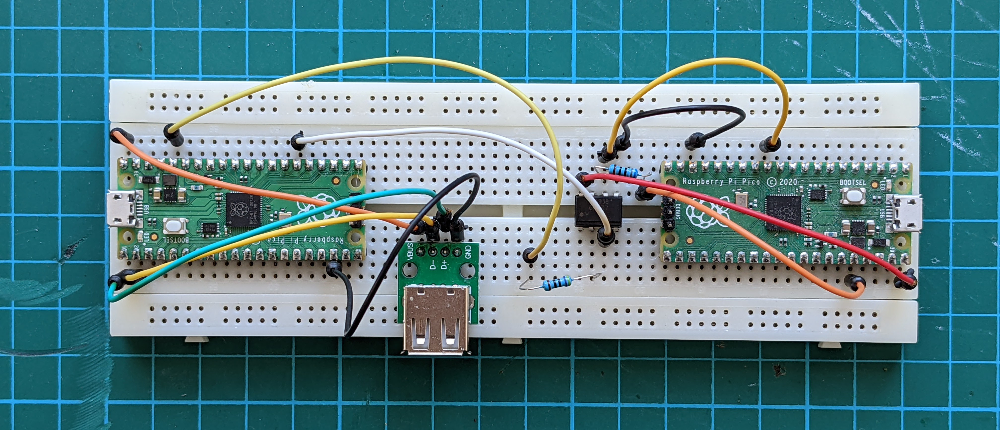
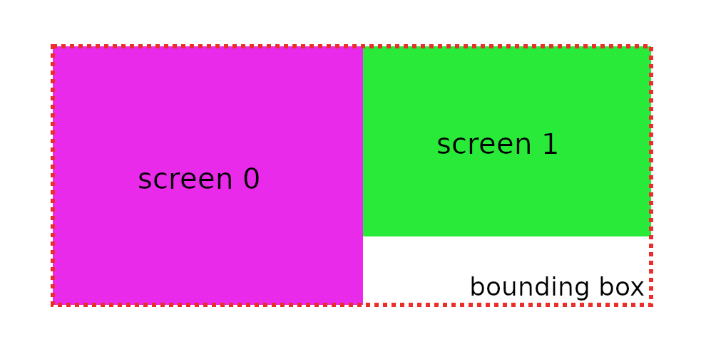

# Screen Hopper: a smart KVM switch

This is a USB input switcher that lets you use you mouse and keyboard with two computers by just dragging the mouse cursor from one screen to the other. It's like Logitech Flow, Mouse without Borders, Synergy or Apple Universal Control, but it works entirely in hardware. No special software is required on the computers. It works with Windows, Linux and Mac.

Here's a [demo video](https://www.youtube.com/watch?v=z24jG9Nh5gk).

This project is derived from [HID Remapper](https://github.com/jfedor2/hid-remapper) so it inherits all the nice features like input remapping, sensitivity adjustment, polling rate overclocking and more. Check out that project's documentation to see its full potential.

Screen shapes and their relative position are configurable [through a web browser](https://www.jfedor.org/screen-hopper-config/) using WebHID (Chrome or Chrome-based browser required).

In addition to dragging the cursor from one screen to the other, you can also map a key or button to switch between screens.

Wireless receivers are supported and multiple devices can be connected at the same time using a USB hub.



## How is it possible?

As you might know, normal mice only send relative inputs (X/Y deltas) to the computer, they don't know where the cursor is on the screen. Screen Hopper needs to know this to be able to switch between the screens. So what it does is it keeps an internal state of where the cursor is based on the inputs received from the mouse and it sends the absolute X/Y position to the connected computers. It is a standard feature of the USB HID protocol, but normally it's only used by devices like touchscreens and graphic tablets.

There are some consequences to this mode of operation, for example the aspect ratios of the screens used need to be configured for Screen Hopper to be able to properly scale the horizontal and vertical inputs. Also it probably won't work very well with games that expect raw mouse inputs.

## How to make the device

There are two hardware versions of the Screen Hopper: the dual Pico version and the triple Pico version. They have the same functionality, but the triple Pico version has better device compatibility - some input devices work with either, but some will only work with the triple Pico version.

See [here](HARDWARE.md) for details on how to make both versions of the device.

## How to use the configuration tool

A live version of the web configuration tool can be found [here](https://www.jfedor.org/screen-hopper-config/). It only works in Chrome and Chrome-based browsers. On Linux you might need to give yourself permissions to the appropriate `/dev/hidraw*` device. The configuration tool should be used on the computer connected to the Pico running `screenhopper.uf2` or `screenhopper_a.uf2`.

Some of the configuration options are inherited from [HID Remapper](https://github.com/jfedor2/hid-remapper) so check that project for the meaning of those settings (the mapping functionality can do really awesome things!).

Screen Hopper needs to know the screen shapes and their relative position to be able to move the cursor between the two computers. You configure that by entering the position (X, Y) and dimensions (width, height) of each screen. (A graphical preview would be nice here, but for now it's just numbers.) The dimensions use abstract units so their absolute values don't mean much, but you will find some combinations give you reasonable mouse sensitivity. You can adjust the sensitivity for each screen separately.

The "Restrict cursor" setting determines what should happen when you drag the mouse cursor outside of the screens (to the area that's not visible). If you select the "to screens" option, it will not be possible to go outside the visible area. If you select the "to bounding box" option, the cursor will be restricted to the smallest rectangle that covers both screens (this only makes a difference if the touching edges of the two screens are not the same length). If you select "don't restrict", the cursor will not stop at any of the screen edges.



Depending on the screens configuration and the "Restrict cursor" setting, it might be possible for the cursor to be outside of the visible area. There's a separate setting for mouse sensitivity for that situation.

If you configure the screens so that they don't touch each other (there's a gap) and select the "restrict to screens" option then it will not be possible to drag the cursor from one screen to the other. You can still switch between the screens by mapping some key or button to "Switch screen".

If you can't use the browser-based configuration tool, there's also a [command-line tool](config-tool) that takes JSON in the same format as the web tool on standard input. I only tested it on Linux, but in theory it should also run on Windows and Mac.

## How to compile the firmware

```
git clone https://github.com/jfedor2/screen-hopper.git
cd screen-hopper
git submodule update --init
cd firmware
mkdir build
cd build
cmake ..
make
```
